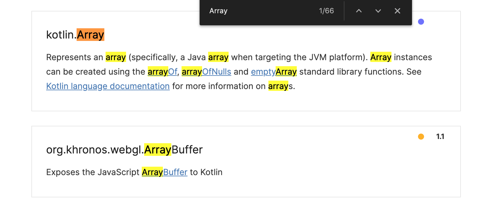
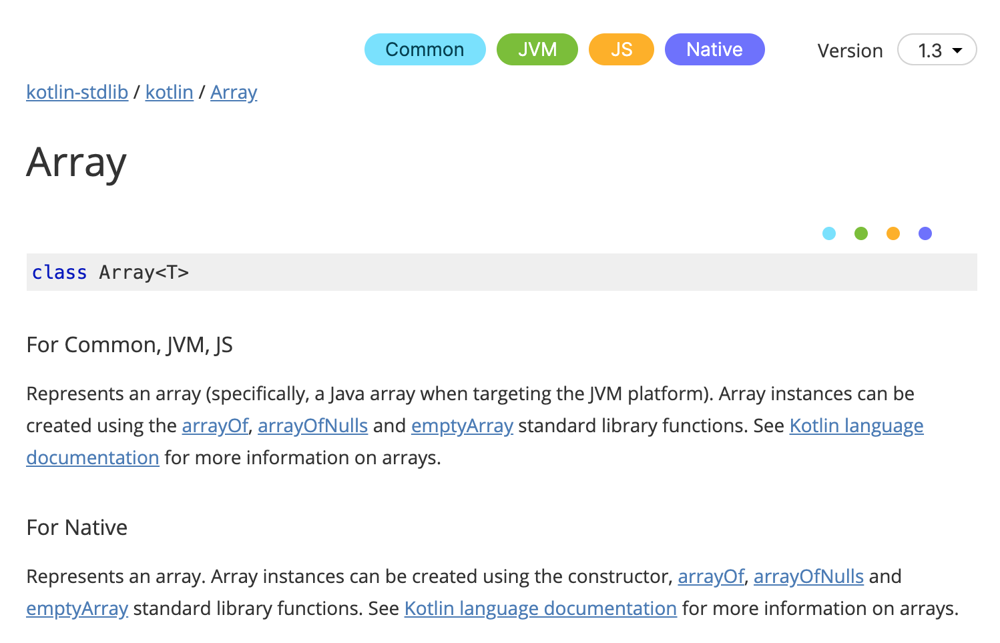
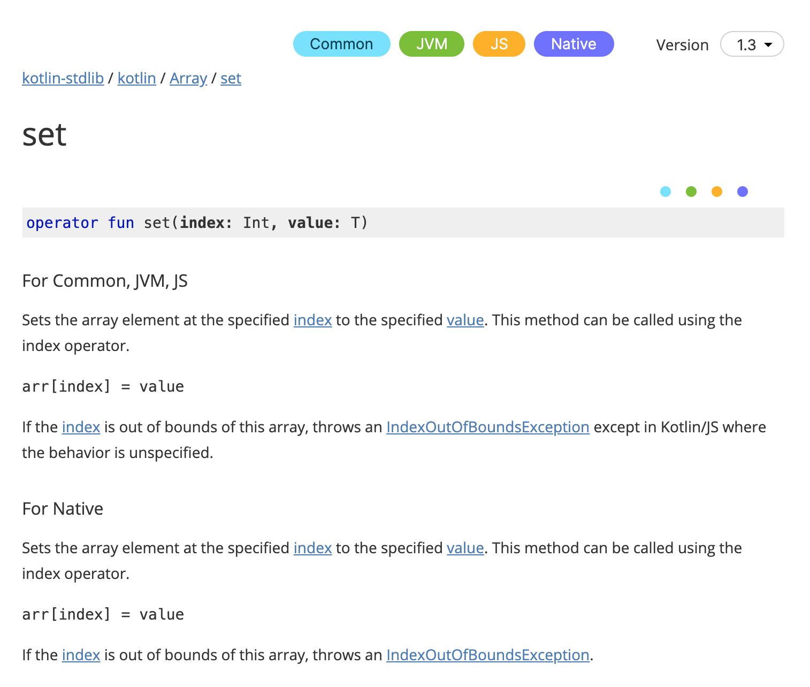

# Домашнее задание к занятию «2.2. ООП: Объекты и классы»

В качестве результата пришлите ссылки на ваши GitHub-проекты в личном кабинете студента на сайте [netology.ru](https://netology.ru).

**Важно**: ознакомьтесь со ссылками на главной странице [репозитория с домашними заданиями](../README.md).

Если у вас что-то не получилось, то оформляйте Issue [по установленным правилам](../report-requirements.md).

Нужно сделать все задачи в **одном** репозитории.

## Как сдавать задачи

1. Создайте на вашем компьютере Gradle-проект.
1. Инициализируйте в нём пустой Git-репозиторий.
1. Добавьте в него готовый файл [.gitignore](../.gitignore).
1. Добавьте в этот же каталог остальные необходимые файлы.
1. Сделайте необходимые коммиты.
1. Создайте публичный репозиторий на GitHub и свяжите свой локальный репозиторий с удалённым.
1. Сделайте пуш и удостоверьтесь, что ваш код появился на GitHub.
1. Ссылку на ваш проект отправьте из личного кабинета на сайте [netology.ru](https://netology.ru).
1. Необязательные задачи можно не сдавать — это не повлияет на получение зачёта. В этом ДЗ все задачи обязательные.

## Задача №1 - Посты

Наконец мы добрались до ООП и можем уже не только решать вычислительные задачи, но и моделировать целые системы.

На лекции мы разобрали упрощённый пример того, как может выглядеть пост, давайте же посмотрим на то, как он выглядит на самом деле. Возьмите себе за правило анализировать системы, с которыми вы работаете в реальной жизни, и продумывать, как бы сделали вы.

В качестве примера возьмём всё тот же VKontakte: https://vk.com/dev/objects/post. Если страница недоступна, воспользуйтесь [копией](assets/post.pdf) из каталога [assets](assets)).

На что нужно обратить внимание:
1. В Kotlin используется `camelCase` для полей.
1. Некоторые поля помечены как `integer [0, 1]`, хотя по логике, должны быть `Boolean` (у вас должны быть `Boolean`).
1. Добавьте из перечисленных в документации около 10 полей простых типов (Int, String, Boolean).
1. Поля типа `object` должны быть описаны отдельными классами. Добавьте хотя бы одно такое поле (например, `comments` или `likes`).
1. Для полей вы можете добавлять значения по умолчанию, аналогично как параметрам функций. При таком подходе вам не нужно будет указывать значения всех аргументов при создании объектов класса.

Что мы хотим получить:
1. Data класс `Post` (и другие классы, которые могут быть вложены в `Post`).
1. Объект `WallService`, который внутри себя хранит посты в массиве.

## Задача №2 - Wall

Теперь нужно разобраться с функциональностью сервиса, отвечающего за стены пользователей: https://vk.com/dev/wall ([копия](assets/wall.pdf)).

Нас будут интересовать следующие методы:
1. Создание записи.
1. Обновление записи.

### Создание записи

Итак, поехали, метод для создания записи должен выглядеть вот так:
```kotlin
    fun add(post: Post): Post {
        TODO()
    }
```

Как он должен работать:
1. Он должен добавлять запись в массив, но при этом назначать посту уникальный среди всех постов идентификатор.
1. Возвращать пост с уже выставленным идентификатором.

<details>
  <summary>Подсказка</summary>

  Возможно, вам стоит завести private переменную для хранения следующего уникального `id`. Пока у нас in-memory система — всё хранится в оперативной памяти, и всё работает на одной машине, этого будет достаточно.
</details>

### Обновление записи

Метод для создания записи должен выглядеть вот так:
```kotlin
    fun update(post: Post): Boolean {
        TODO()
    }
```

Как он должен работать:
1. Он должен находить среди всех постов запись с тем же `id`, что и у `post` и обновлять все свойства, кроме `id` владельца и даты создания.
1. Если пост с таким `id` не найден, то ничего не происходит и возвращается `false`, в противном случае - возвращается `true`.

<details>
  <summary>Документация на Array</summary>

Для работы с любыми типами вам вполне могут понадобиться методы и операторы из тех, что мы ещё не проходили. Иначе курс превратится в чтение документации о методах.

Поэтому нам важно, чтобы вы знали, где и как в таких случаях искать информацию. Искать её нужно не на StackOverflow или в статьях, а на официальном сайте.

1\. Поскольку вы знаете, что класс называется `Array`, то идёте по адресу https://kotlinlang.org/api/latest/jvm/stdlib/alltypes/ и через Ctrl + F (либо Cmd + F в Mac) ищете `Array`:



Кликаете для перехода

2\. На странице описания вы видите, на каких платформах доступен этот тип и как можно создавать его экземпляры:



3\. Далее будет идти описание конструкторов, свойств и функций, вы можете выбрать интересующее вас:


4\. Внутри с помощью «кусочков» кода будет описано, как эту функцию использовать, включая, например, использование в виде оператора `[]`:



Т.е. на самом деле, `set` - это и есть `[]`, который мы использовали в лекции.

Обратите внимание: в Kotlin по сравнению с Java, добавлено просто огромное количество готовых функций и различных удобных способов что-то сделать минимумом кода. Поэтому прежде чем писать что-то, особенно в части работы с набором элементов, обязательно почитайте документацию. Вполне вероятно, что готовое решение уже существует.
</details>

## Задача №3 - Wall Tests

Куда же без автотестов? Правильно, никуда. Нужно написать автотесты на ваши методы:
* на `add` - всего один, который проверяет, что после добавления поста `id` стал отличным от 0.
* на `update` - целых два:
    - изменяем пост с существующим `id`, возвращается `true`;
    - изменяем пост с несуществующим `id`, возвращается `false`.

Почему мы не проверяем, что `add` действительно добавил, а `update` действительно что-то меняет?

Нам пока совсем немного не хватает знаний, чтобы достроить нашу систему до действительно тестируемой — их мы получим на следующей лекции. Пока же сделаем так.

По факту речь идёт о том, что нам придётся либо дописать специальные вспомогательные методы, либо научиться работать с `nullable` значениями.

### Проблемы синглтонов

С синглтонами есть одна большая проблема - они создаются один раз при старте приложения и в единственном экземпляре.

Тестировать такое не всегда удобно: вы либо должны сделать метод, который «вычищает» синглтон, т.е. сбрасывает массив записей, либо переделать `object` на обычный класс.

Если вы сделаете обычный класс, тогда в каждом тесте вы можете поступить следующим образом. Пример для `update`:

```kotlin
class WallServiceTest {
    @Test
    fun updateExisting() {
        // создаём целевой сервис
        val service = WallService()
        // заполняем несколькими постами
        service.add(Post(/* заполняете поля */))
        service.add(Post(/* заполняете поля */))
        service.add(Post(/* заполняете поля */))
        // создаём информацию об обновлении
        val update = Post(/* заполняете поля */)

        // выполняем целевое действие
        val result = service.update(update)

        // проверяем результат (используйте assertTrue или assertFalse)
        assertTrue(result)
    }
}
```

Если вы хотите оставить `WallService` в виде `object`, то можно добавить в него метод очистки `clear`:

```kotlin
object WallService {
    private var posts = emptyArray<Post>()

    fun clear() {
        posts = emptyArray()
    }
}
```

А затем указать JUnit с помощью аннотации `@Before`, что метод необходимо вызывать перед каждым тестом:

```kotlin
class WallServiceTest {

    @Before
    fun clearBeforeTest() {
        WallService.clear()
    }

    @Test
    fun updateExisting() {
        ...
    }
}
```

### Итог:
1. У вас должен быть репозиторий на GitHub, в котором будет ваш Gradle-проект.
1. К репозиторию должен быть подключён GitHub Actions.
1. Сборка должна быть «зелёной» — ваши тесты должны проходить.
